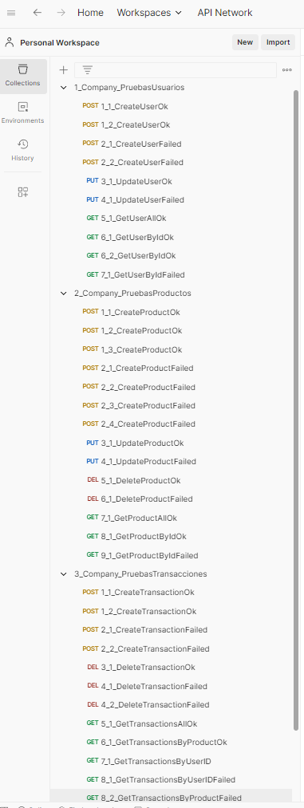

# Company

## Descripción General

Primero se va a realizar una breve descripción del desarrollo que se realizó en el **BackEnd**, y después se describen las consideraciones a tener en cuenta para poner en funcionamiento el Sistema.

---

## Descripción BackEnd

El **BackEnd** se construyó usando **.NET 8**, aplicando la **arquitectura hexagonal** o de puertos y adaptadores, junto con **CQRS** (Command Query Responsibility Segregation) para separar responsabilidades entre consultas (Queries) y operaciones (Commands).

### Capas del BackEnd

- **API**: Contiene los controladores y endpoints de la aplicación.
- **Application**: Orquesta los servicios de dominio como Commands, Queries y Handlers.
- **Infrastructure**: Implementaciones concretas de los adaptadores, comunicación con tecnologías externas y persistencia de datos.
- **Domain**: Lógica de negocio, incluyendo entidades, objetos de valor, reglas de negocio, puertos, comandos y consultas.
- **Domain.Tests**: Contiene las pruebas unitarias de la capa de dominio.

### Patrones de Diseño Utilizados

- **Inyección de dependencias**
- **Patrón AAA (Arrange, Act, Assert)**
- **Patrón Builder**
- **CQRS**
- **Decoradores**
- **DTO (Data Transfer Object)**

---

## Configuración y Ejecución de la Aplicación

---

### Descripción Base de Datos y ejecución de Scripts

Para que el sistema funcione, se debe de configurar primero la base de datos, dado que la aplicación esta diseñada bajo el enfoque DB First, Por lo que se deben seguir estos pasos:

1. Tener una instancia de **postgres SQL** con un usuario con permisos suficientes para crear bases de datos y tablas.
2. Ejecutar el script `1_CreateDataBase.sql` para crear la base de datos, el cual esta ubucado en la carpeta `Company/SCRIPTS`
3. Una Vez creada la base de datos, con nombre `company_heylermontoya`, Asegurarse que los siguientes Queries, se ejecuten sobre la base de datos creada.
4. Ejecutar el script `2_CreateTablesAndData.sql`, el cual crea todas las tablas e inserta la información base de los roles que maneja la aplicación. Las demas tablas estaran vacias, las cuales se llenan a medida en que se interactua con la aplicación.


---

### Descripción BackEnd

Para correr el **BackEnd** en **.NET 8**, sigue estos pasos:

1. **Instalar el .NET 8 SDK** desde [aquí](https://dotnet.microsoft.com/es-es/download).
2. Tener una instancia de **postgres SQL** con un usuario con permisos suficientes para crear bases de datos.
3. **Clonar el repositorio.**
4. Edita el archivo `appsettings.json` en la carpeta `Company.Backend\Company.Api` para ajustar la cadena de conexión a postgres SQL:

    ```json
      "StringConnection": "Host=localhost;Port=5432;Database=company_heylermontoya;Username=postgres;Password=H3yl3r"
    ```

5. Ejecuta las migraciones de **Entity Framework** para obtener la información de todas las tablas de la base de datos y ser mapeadas e la aplicación en el backend:

    a) Instala el CLI de **EF Core**:
    ```bash
    dotnet tool install --global dotnet-ef
    ```

    b) Crea la migración bajo el enfoque de DB First, ubiquese desde la carpeta `Company.Backend/Company.Infrastructure`.  Ejecutar el siguiente comando base, teniendo en cuenta que se debe modificar las credenciales de la conexión a postgres SQL.
    ```bash
    dotnet ef dbcontext scaffold "Host=localhost;Port=5432;Database=company_heylermontoya;Username=postgres;Password=H3yl3r" Npgsql.EntityFrameworkCore.PostgreSQL -o ..\Company.Domain\Entities\ -c PersistenceContext --context-dir .\Context\ --force
    ```

6. Ejecuta la aplicación con el siguiente comando desde la raíz del proyecto:
    ```bash
    dotnet run --project .\Company.Api\Company.Api.csproj
    ```

    La aplicación estará disponible en el puerto `5443`.

7. Abre el navegador y valida la documentación de la API en **Swagger**:
    ```bash
    https://localhost:5443/swagger/index.html
    ```

--- 

Con lo anterior ya deberia de poder ver la aplicacion funcionando correctamente.

### Datos Adicionales, para validar el funcionamiento de la aplicaión

1. Se muestra la documentacion de la api que se genera con swagger.


[ver documentación de la api con swagger](./DocumentationWithSwaggerWebApi/DocumentationWithSwagger.json)

2. Se proporciona 3 colecciones de Postman, para que sea ejecutado desde el equipo donde se ponga en funcionamiento la aplicación. Tener en cuenta que las colecciones de Postman y cada uno de sus Request estan enumerados y ordenados, los cuales se deben de ejecutar en ese orden, para poder validar el funcionamiento de la aplicación.

Las colecciones de Postman, se encuentran en la carpeta `Company/POSTMAN`, las cuales pueden ser importadas en Postman para probar la aplicación.




---